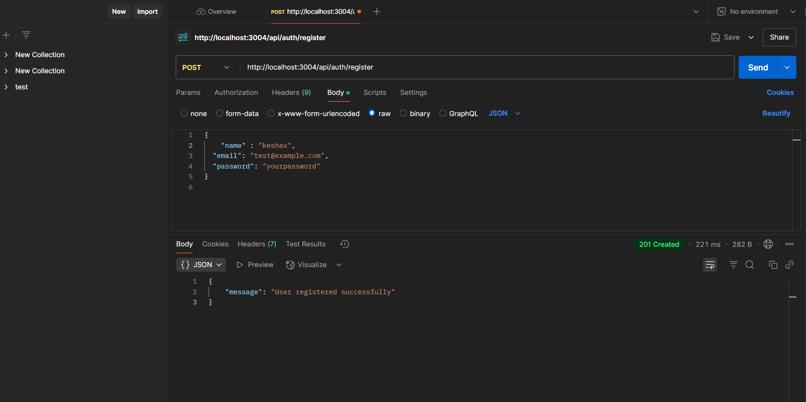
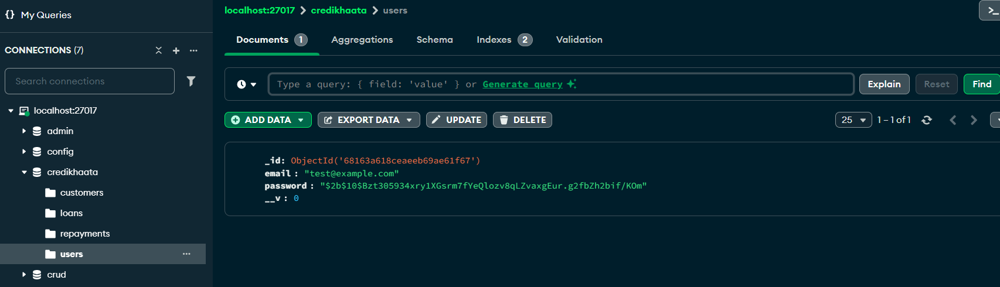
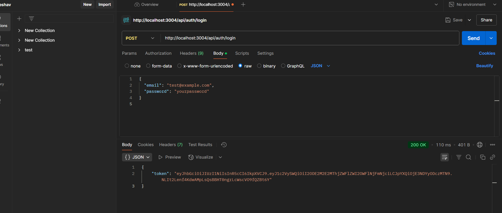
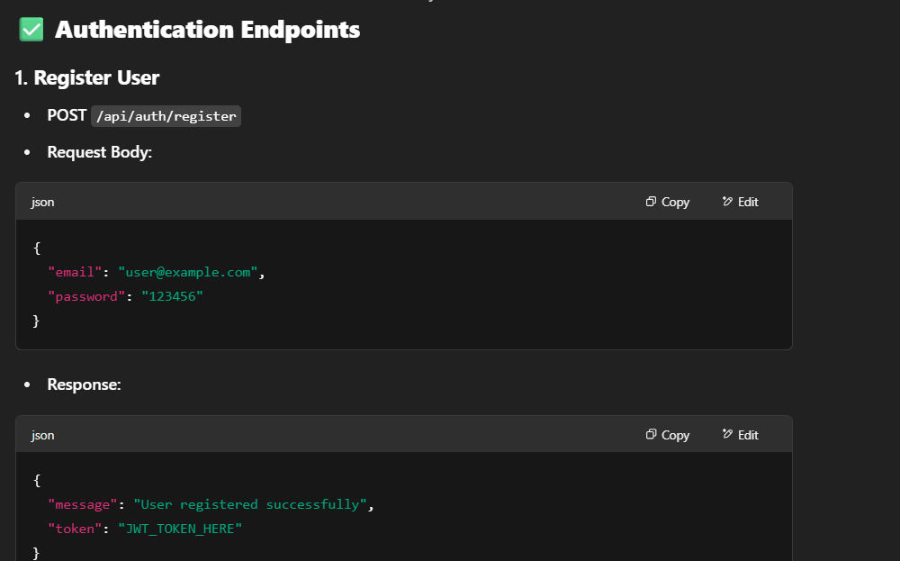
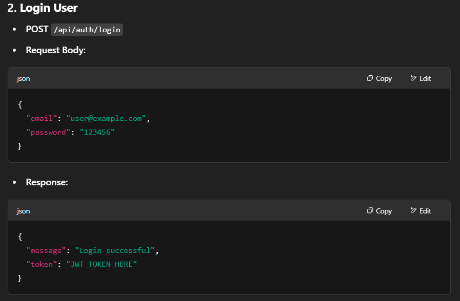
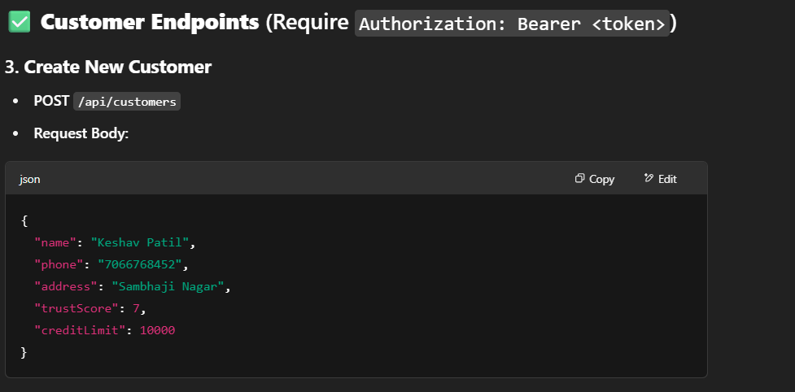
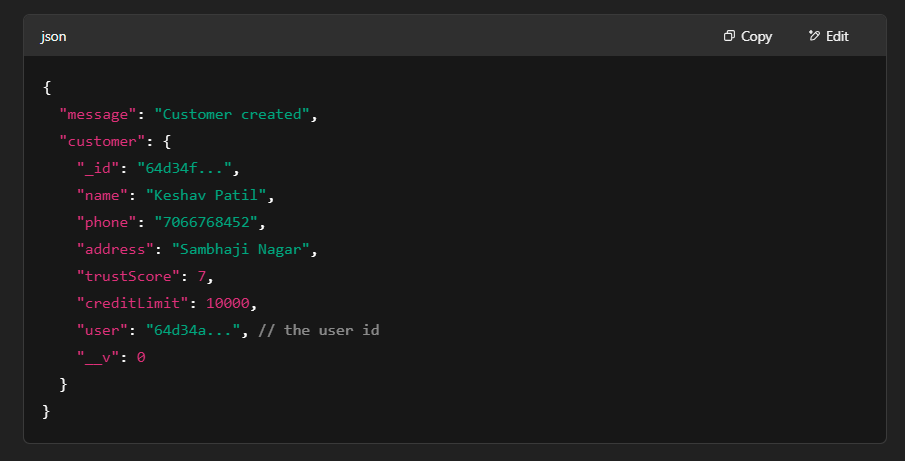
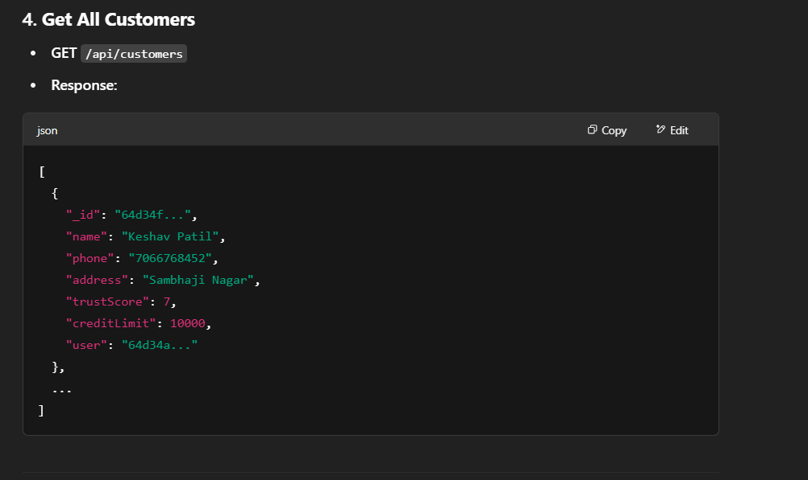

CrediKhaata - Loan Tracker for Shopkeepers

CrediKhaata is a RESTful backend service that allows shopkeepers to : manage customers, track credit sales (loans), handle repayments,
receive overdue payment alerts.

This system is built using Node.js, Express, and MongoDB (or alternatives), providing a simple and scalable solution for small businesses to digitize their credit transactions.

✅ Step-by-Step Setup Guide how to run it okk follow given steps

Step 1 – Clone or download the project folder Get the credikhaata-backend folder from me.

✅Step 2 – Open the project in terminal or VS Code

✅Step 3 – Install required packages Run this in the terminal: bash Copy Edit npm install

✅Step 4 – Create a .env file in the root folder Add the following environment variables:ni Copy Edit PORT=3004 MONGO_URI=your_mongodb_connection_url JWT_SECRET=your_jwt_secret_key ⚠️ If using local MongoDB, make sure MongoDB is running on your system.

✅Step 5 – Start the backend server To run the server in development mode: bash Copy Edit npm run dev

OR to run it normally:

bash Copy Edit npm start

Step 6 – Test the API Use Postman or similar tool to test the API endpoints: Register/login Add customer Create loans Record repayments View summary/overdue loans

💡 Notes Make sure your .env file is correctly configured.

This is a backend-only project. You can build or connect a frontend later if needed.

Contact me if any dependency or command fails — I’ll help!

1) User Ragistered Sucessfully

2) Database 

3) Login Sucessfully token generated

Ragister and login route

1. Register User
   - POST /api/auth/register
   - Request Body:
     {
       "email": "user@example.com",
       "password": "123456"
     }
   - Response:
     {
       "message": "User registered successfully",
       "token": "JWT_TOKEN_HERE"
     }

2. Login User
   - POST /api/auth/login
   - Request Body:
     {
       "email": "user@example.com",
       "password": "123456"
     }
   - Response:
     {
       "message": "Login successful",
       "token": "JWT_TOKEN_HERE"
     }

     1. Create New Customer
   - POST /api/customers
   - Request Body:
     {
       "name": "Keshav Patil",
       "phone": "7066768452",
       "address": "Sambhaji Nagar",
       "trustScore": 7,
       "creditLimit": 10000
     }
   - Response:
     {
       "message": "Customer created",
       "customer": { ... }
     }

2. Get All Customers
   - GET /api/customers
   - Response:
     [ { customer1 }, { customer2 }, ... ]

3. Update Customer
   - PUT /api/customers/:id
   - Request Body:
     {
       "phone": "1234567890"
     }
   - Response:
     {
       "message": "Customer updated",
       "customer": { ... }
     }

4. Delete Customer
   - DELETE /api/customers/:id
   - Response:
     {
       "message": "Customer deleted"
     }
""")

Dependencies
express: Web framework for Node.js

mongoose: MongoDB object modeling tool

jsonwebtoken (JWT): Authentication middleware using JSON Web Tokens

bcryptjs: Password hashing for user authentication

validator: Email and data validation

moment: Date manipulation library

dotenv: Environment variable management PORT="2025" MONGODB_URI="mongodb://localhost:27017/credikhaata" JWT_SECRET="networthsecretkey"

dotenv: Manage sensitive information like DB connection strings, JWT secrets, etc.

